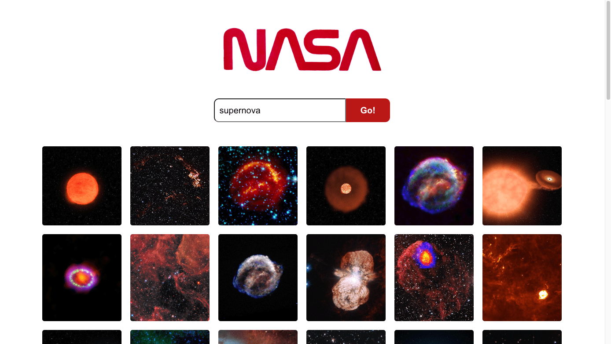

# 🪐 NASA Image Search Engine App 

A React-based search engine that returns images using a NASA API endpoint.

## Table of contents

- [Introduction](#introduction)
- [Concepts covered](#concepts-covered)
- [Setup & getting started](#setup-&-getting-started)
- [Using the app](#using-the-app)
- [Author](#author)

## Introduction

This is a search engine built using React as a practice for a technical test with the following requirements:
- A Search page which allows users to search for images by keyword
- Images must be returned upon a successful search
- Relevant API endpoint: `GET​​ ​​https://images-api.nasa.gov/search ​Params: ​​q`

The app was created by bootstratpping with create-react-app and tested using Jest and React Testing Library. The pictures below show how the resulting app looks like on computer and mobile screens.  

## Concepts covered

- React, a JavaScript library, to build user interfaces (UI) and web applications
- Incorporating HTML in React using JSX (JavaScript XML)
- React state, props and hooks to create, pass and manage/configure data
- React Testing Library (RTL) to test UI 
- Event handling
- Making a HTTP request to an API using axios package in JavaScript and processing the response

## Setup & getting started
- Create a fork of this repo and clone the fork. 
- Change directory into the cloned folder and install project dependencies. This app requires React, Axios and dev dependencies RTL.
- To test the app, run `npm test`.
- To start the app, run `npm start`. This starts the app at http://localhost:3000. 

## Using the app
Start by typing the search term in the search box and press 'Go!' button. If the search doesn't find anything, 'No matching images. Try again.' message appears. 

## Future work
If I have more time, I would like to improve on the general appearance of the app.

------------------

## Author

👤 **HJ Kang** 
- GitHub [@cocomarine](https://github.com/cocomarine) 
- LinkedIn [@hj-kang07](https://www.linkedin.com/in/hj-kang07/) 
